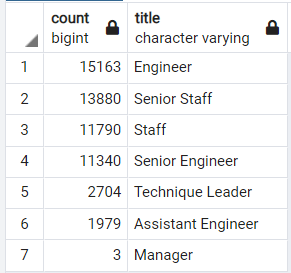

# Pewlett Hackard "Silver Tsunami" Analysis

## Overview:
We will help Pewlett Hackard evaluate their current employee population to prepare for a possible wave of upcoming retirements. We will use SQL to analyze employee information stored in six CSV files.

## Results:
* Using SQL we were able to organize and filter employee information stored in multiple CSV files to show the distribution of titles of current employees between the age of 67 and 70. We can thus conclude about 70,000 current employees could be retiring in the next few years.

   
 
* The detailed retiring employee information behind the above table is stored in [unique_titles.csv](Data/unique_titles.csv) file.

* To prepare for a possible wave of vacancies in these positions, we take a look at possible employees who can mentor the "next generation" of talents. To do that, we identified the current employees who are about age 57 and stored that in the [mentorship_eligibilty.csv](Data/unique_titles.csv) file.

* From our analysis, we see that Pewlett Hackard only has about 1,500 employees that are around age 57, far less than the 70,000 employees that could be retiring in the next few years.

## Summary:
To better manage the 70,000 possible vacancies of positions from the upcoming "Silver Tsuami", we recommend Pewleet Hackard expand their mentorship program to include employees with birthdates between 1962 to 1967. We identified these employees with their information in the [expand_mentorship.csv](Data/expand_mentorship.csv) file.  In this expanded program, we will have about 57,000 possible mentors. We believe this mentorship program will better promote talents within to fill the upcoming vacancies.

 

