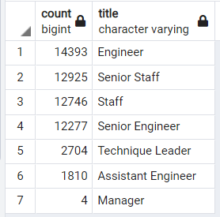

# Pewlett Hackard "Silver Tsunami" Retirement Analysis

## Overview:
We will help Pewlett Hackard evaluate their current employee population to prepare for the upcoming retirement wave. We will use SQL to analyze employee information stored in six CSV files.

## Results:
* Using SQL we were able to organize and filter employee information stored in multiple CSV files to show the distribution of titles of current employees between the age of 67 and 70 in the table below. We can thus conclude that about 70,000 current employees could be retiring in the next few years.The detailed employee information of this group of employees is stored in the
[unique_titles.csv](Data/unique_titles.csv) file.

   

* From the table above we see majority of the retiring employees are senior employees or staff.  To fill these positions, Pewlett Hackard plans to set up a mentorship program to promote from within.

* We are tasked to identified possible mentors from current employee by listing out all employees who are born in 1965 or about 57 years old. This resulted in a list of about 1,500 employees and we stored their information in the [mentorship_eligibilty.csv](Data/unique_titles.csv) file.

* From our analysis, we believe 1,500 mentors may not be enough to generate enough candidates to fullfill possible vacacies leave behind from the upcoming 70,000 possible retiring employees.

## Summary:
To better manage the 70,000 possible vacancies of positions from the upcoming "Silver Tsuami", we recommend Pewleet Hackard expand their mentorship program to include employees with birthdates between 1962 to 1967. We identified these employees with their information in the [expanded_mentorship.csv](Data/expand_mentorship.csv) file.  In this expanded program, we will have about 57,000 possible mentors. We believe this mentorship program should be able to promote talents within to fill these upcoming vacancies.  Below table show the distribution of title for these mentors.

 

