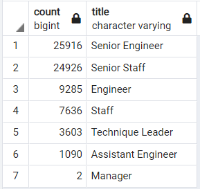

# Pewlett Hackard "Silver Tsunami" Analysis

## Overview:
We will help Pewlett Hackard evaluate their current employee population to prepare for possible wave of upcoming retirments.  We will use SQL to analyze employee information stored in six CSV files.  

## Results:
Using SQL we were able to organize and filter employee information stored in multiple CSV files to show the distribution of titles for current employees between the age of 67 and 70

The detailed retiring employee information behind the above table is stored in unique_titles.csv

[unique_titles.csv](Data/unique_titles.csv)

## Summary:
